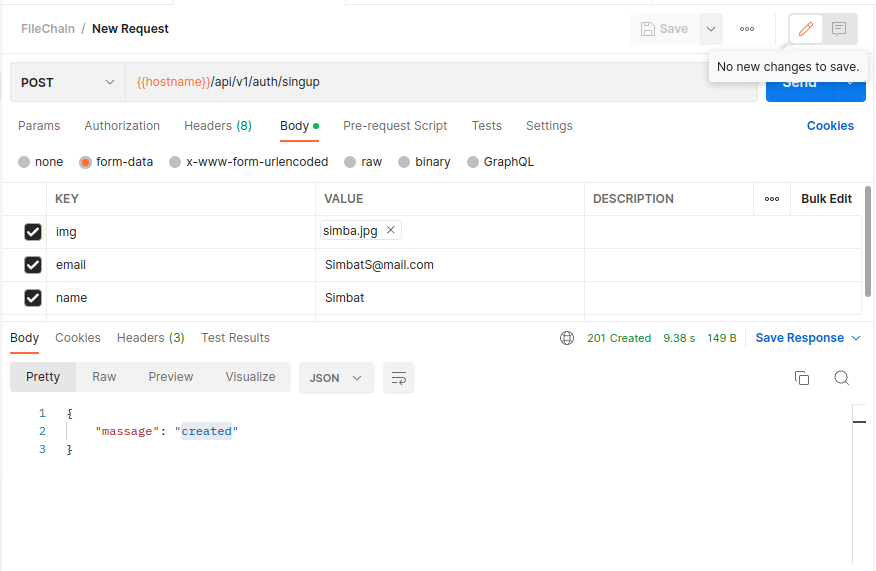
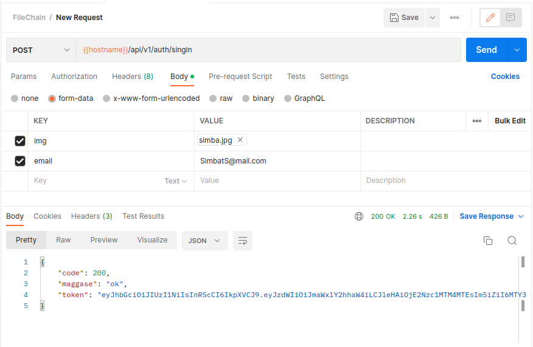
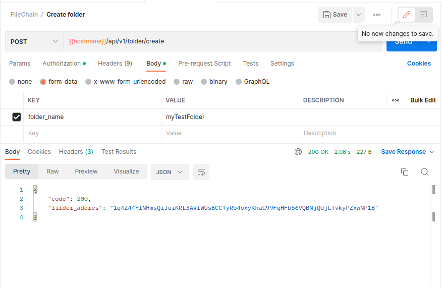
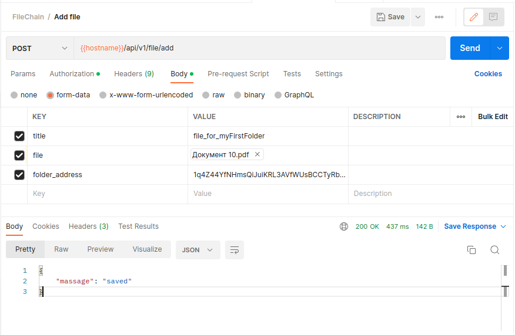

## Filechain REST API docs

- URI path: [localhost]/api/[api_version]/
- API version: v1

------------------------------------------------------------------------------------------

### Authorization

    
<code>POST</code><code><b>/auth/singup</b></code>

#### Parameters
> | name |  type    |   data type   | description   | 
> |------|----------|---------------|---------------|
> | Img  | required |   File        | User iamge    |     
> | Email| required |   String      | User email address |
> | Name | required |   String      | User name     |

#### Responses

> | http code   |   content-type    |   response    |
> |-------------|-------------------|---------------|
> | `201`       | `text/plain;charset=UTF-8`        | `{"code":"200","message":"created"}`          |
> | `400`       | `application/json`                | `{"code":"400","message":"Bad Request"}`      |
> | `500`       | `text/html;charset=utf-8`         |  None                                         |

#### Example POSTMAN

    
<code>POST</code><code><b>/auth/singin</b></code>

#### Parameters
> | name |  type    |   data type   | description   | 
> |------|----------|---------------|---------------|
> | Img  | required |   File        | User iamge          |     
> | Email| required |   String      | User email address |

#### Responses

> | http code   |   content-type    |   response    |
> |-------------|-------------------|---------------|
> | `200`       | `text/plain;charset=UTF-8`        | `{"code":"200","token":"pdojhp#h4jv355#l&mph"}`          |
> | `400`       | `application/json`                | `{"code":"400","message":"Bad Request"}`      |
> | `500`       | `text/html;charset=utf-8`         |  None                                         |

#### Example POSTMAN

    
<code>POST</code><code><b>/auth/delete</b></code>

#### Parameters
> | name |  type    |   data type   | description   | 
> |------|----------|---------------|---------------|
> | Img  | required |   File        | User iamge          |     
> | Email| required |   String      | User email address |

#### Responses POSTMAN

> | http code   |   content-type    |   response    |
> |-------------|-------------------|---------------|
> | `200`       | `text/plain;charset=UTF-8`        | `{"code":"200"}`                              |
> | `400`       | `application/json`                | `{"code":"400","message":"Bad Request"}`      |
> | `500`       | `text/html;charset=utf-8`         |  None                                         |

#### Example

<!--  -->

------------------------------------------------------------------------------------------

### Forder

    
<code>POST</code><code><b>/folder/create</b></code>

#### Parameters
> |     name    |  type    |   data type   | description         | 
> |-------------|----------|---------------|---------------------|
> | token       | required |   File        | User iamge          |     
> | folder_name  | required |   String      | User email address  |

#### Responses POSTMAN

> | http code   |   content-type    |   response    |
> |-------------|-------------------|---------------|
> | `200`       | `text/plain;charset=UTF-8`        | `{"code":"200", "forder_address"}`            |
> | `400`       | `application/json`                | `{"code":"400","message":"Bad Request"}`      |
> | `500`       | `text/html;charset=utf-8`         |  None                                         |

#### Example

    
<code>POST</code><code><b>/folder/all</b></code>

#### Parameters
> |     name    |  type    |   data type   | description         | 
> |-------------|----------|---------------|---------------------|
> | token       | required |   string      | Beare  token        |     

#### Responses POSTMAN

> | http code   |   content-type    |   response    |
> |-------------|-------------------|---------------|
> | `200`       | `text/plain;charset=UTF-8`        | `{"code":"200", [addresses]}`                 |
> | `400`       | `application/json`                | `{"code":"400","message":"Bad Request"}`      |
> | `500`       | `text/html;charset=utf-8`         |  None                                         |

#### Example

<!--  -->

------------------------------------------------------------------------------------------

### Forder

    
<code>POST</code><code><b>/file/add</b></code>

#### Parameters
> |     name    |  type    |   data type   | description         | 
> |-------------|----------|---------------|---------------------|
> | token       | required |   File        | User iamge          |     
> | folder_address| required |   String      | User email address  |
> | folder_name  | required |   String      | User email address  |

#### Responses POSTMAN

> | http code   |   content-type    |   response    |
> |-------------|-------------------|---------------|
> | `200`       | `text/plain;charset=UTF-8`        | `{"code":"200"}`            |
> | `400`       | `application/json`                | `{"code":"400","message":"Bad Request"}`      |
> | `500`       | `text/html;charset=utf-8`         |  None                                         |

#### Example

